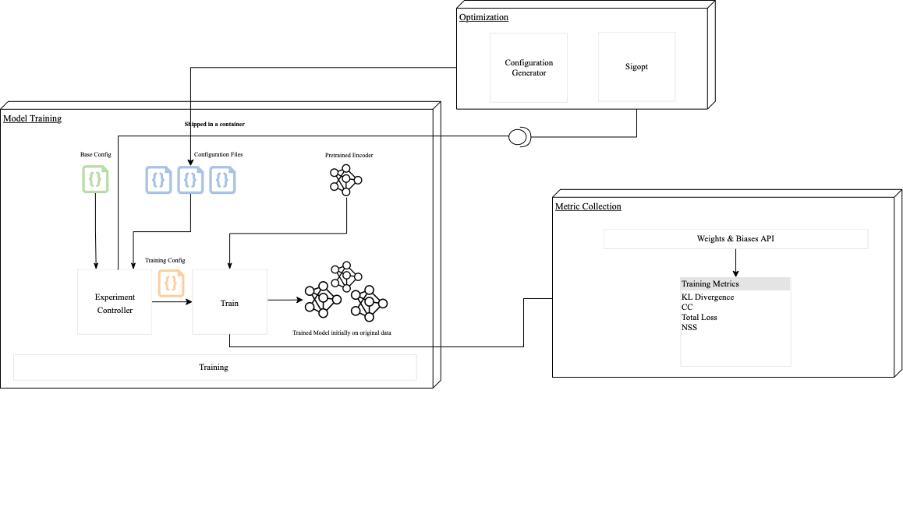
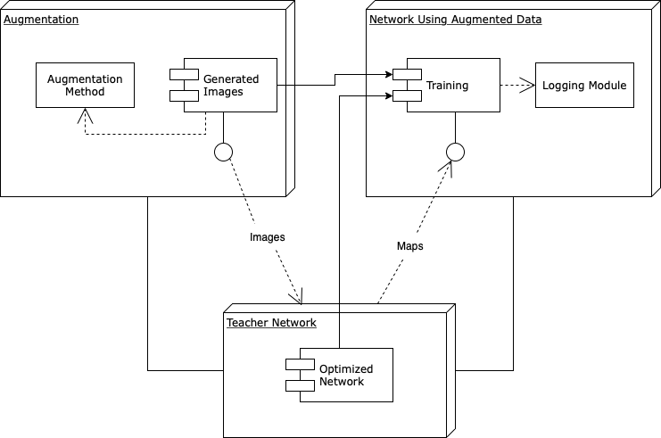

## Abstract
Data Augmentation is a technique commonly used in Machine Learning to increase the size of a dataset by generating new, synthetic data samples from the existing data. In the context of saliency prediction, Data Augmentation can be used to leverage the performance of Deep Learning models by providing additional data to train on. In this work, we explore different augmentation techniques and investigate how augmentation can affect modern Neural Network Architectures. We were able to achieve an increase in the performance of Neural Networks trained using augmented data and classify the augmentation technique used based on their impact on the performance.


## Contribution 

Our study has demonstrated that the choice of Data Augmentation techniques can significantly impact the performance of a Deep Learning model for saliency prediction. By analyzing the effects of various techniques on network performance, we were able to identify those that were most effective and showed the correlation with the saliency retargeting of the techniques. Our results showed that augmentations with high mean intensity differences from the original, non-augmented maps had a negative impact on network performance, while those with low retargeting improved performance. 

In particular, we found that JPEG Compression was an effective method for improving performance, and that adjusting the quality of this technique had a significant impact on the results. By using low quality JPEG Compression, we were able to achieve the best performance while also significantly reducing the size of the dataset. These results highlight the importance of carefully considering Data Augmentation techniques in the design and training of Deep Learning models.

## Pipeline 
Our pipleline is mainly divided into: 
1. Generate New data using different Augmentation techniques
2. Optimizing the Neural Network used to generate the maps of the augmented data
3. Train new networks with the augmented images as input and the predicted map by the optimized Net as ground truth saliency
This can be seen in the following figures:





## Walkthrough 
It is important to mention that in this repositroy, we provide with the notebooks and python scrips to generate the augmented data and the correspondive maps, as well as the visualization. 
All the generated data and saved models are saved in the **drive** under the directory **dhahri**. 

### Data preparation
Download the [SALICON](http://salicon.net/challenge-2017/) except the maps and place the zips in this hiearchy: 

```
└── Dataset  
    ├── fixations  
    │   ├── train  
    │   └── val  
    ├── images  
    │   ├── train  
    │   └── val  
    ├── maps  
        ├── train  
        └── val  
```
We host the maps as pngs instead of matlab arrays and the pretrained PNASNet-5 weights under the [link](https://drive.google.com/drive/folders/1HzpXVcO7rWJT3hX_u-4SLHwJKuvdyFLC?usp=sharing)

### Optimizing the Network 
Place the PNASNet-5 weights inside [saliency/PNAS](saliency/PNAS) directory and use [our experiment controller](saliency/SimpleNet/experiment.py) to optimize the network using different config files. 
An example of [config file](saliency/cfgs/testbenchmark_1.json) 

### Augmenting the data, generate maps and Train
To execute the 18 augmentations proposed use the [aug_dir.py](saliency/aug_dir.py) script and use the network from the previous step to generate the map (For internal EPFL staff please refer to the mounted files on the cluster)
Once we have the images and the maps, we train for each transformation for 15 epochs

The notebook [hyper_augment.ipynb](notebooks/hyper_augment.ipynb) contains the details about generating data for JPEG Compression experiment and the analysis.

### Analysis 
The analysis are represend in the notebooks and the paper. 
**PS**: the notebooks containing train is for ressource managment and training using different pods and are not relevant for externals

## Refrences
Navyasri Reddy, Samyak Jain, Pradeep Yarlagadda, and Vineet Gandhi. "Tidying Deep Saliency Prediction Architectures." CoRR, abs/2003.04942, 2020. https://arxiv.org/abs/2003.04942.
